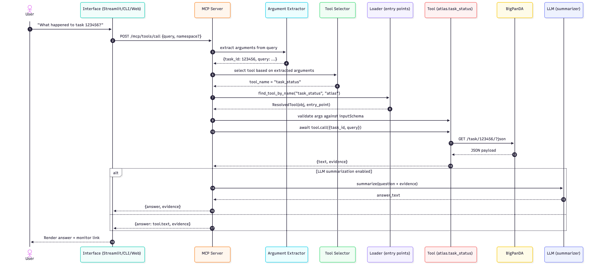

# MCP server and LLM internals

This document explains how the MCP (Message / Model / Plugin Coordinator) server processes a prompt such as:

> “What happened to task 123456?”

## High-level flow

1. Client sends a prompt to MCP
2. MCP selects and validates a tool
3. Tool executes and returns structured evidence
4. LLM (optional) summarizes evidence
5. MCP returns answer + evidence

## Tool-first architecture

- Tools are authoritative and produce **evidence**
- LLMs summarize, explain, and format tool output
- Evidence is always returned to make answers auditable

## Typical request

```http
POST /mcp/tools/call
Content-Type: application/json

{
  "query": "What happened to task 123456?",
  "namespace": "atlas"
}
```

## Tool discovery

Tools are discovered via Python entry points in the `bamboo.tools` group (with optional legacy fallback to `askpanda.tools`).

Example entry point:

```toml
[project.entry-points."bamboo.tools"]
"atlas.task_status" = "askpanda_atlas.task_status:panda_task_status_tool"
```

## Tool execution contract

Each tool provides:

- `get_definition()` returning a dict with an `inputSchema`
- `async call(arguments)` returning `{"text": "...", "evidence": {...}}`

## LLM integration (latest guidance)

LLMs are invoked **after** tool execution.

Input to the LLM should include:
- the original user question
- the tool’s structured evidence
- explicit instructions such as:
  - do not invent facts
  - reference monitor URLs
  - keep the summary concise
  - suggest next actions only when supported by evidence

The LLM is treated as a presentation layer; evidence remains the source of truth.

## Error handling (recommended)

- 400: invalid arguments / schema validation failure
- 404: no suitable tool found
- 502: tool failure, timeout, or upstream service error

## Sequence diagram

An example of the MCP request flow: what happens when a client sends a prompt to the MCP server.


